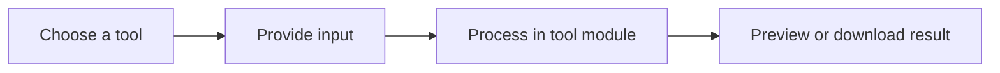

# Browser Utility Toolkit

<p align="center">
  <strong>A responsive collection of practical browser-based file, media, speech, and productivity tools.</strong>
</p>

<p align="center">
  
  
  
</p>

## Overview

This project brings commonly needed utilities into one clean web interface. It includes media helpers, PDF and image tools, speech utilities, generators, and converters, with responsive navigation and light or dark theme support.

## The problem

People often move between unrelated websites for simple tasks such as resizing an image, generating a QR code, converting a file, or creating a strong password. That creates friction and exposes files to multiple services.

## The solution

A single React application organizes these workflows behind a consistent interface. Each utility has its own route while sharing layout, theme, feedback, and responsive UI components.

## What it demonstrates

- Reusable React component architecture
- Type-safe frontend development with TypeScript
- Responsive interface design with Tailwind CSS and shadcn/ui
- Client-side routing and consistent tool workflows

## Core capabilities

| Capability | Practical value |
|---|---|
| Media tools | YouTube media and thumbnail utility interfaces |
| File tools | Image-to-PDF, PDF-to-Word, and PDF-to-JPG workflows |
| Speech tools | Text-to-speech and speech-to-text interfaces |
| Image tools | Compression and resizing utilities |
| Generators | Password and QR-code tools |
| Conversion | Unit conversion from one interface |

## Workflow



## Technology

- React 18
- TypeScript
- Vite
- Tailwind CSS
- shadcn/ui and Radix UI
- React Router

## Project status

**Frontend application**

Some utilities may require a backend or provider integration before they can process production workloads. The UI and routing architecture are present.

## Run locally

```bash
git clone https://github.com/nasratulnayem/browser-utility-toolkit.git
cd browser-utility-toolkit
npm install
npm run dev
```

## Usage

Open the local Vite URL, choose a utility, provide its input, and follow the tool-specific interface.

## Engineering notes

- Configuration and credentials should be supplied through environment variables or local files excluded from Git.
- Generated output and runtime data should not be committed.
- Claims in this README describe the capabilities visible in this repository.
- Before production deployment, review authentication, rate limits, error handling, logging, and provider terms.

## Roadmap

- [ ] Add automated tests for every tool
- [ ] Document which tools are fully local and which need server APIs
- [ ] Add real screenshots and a hosted demonstration
- [ ] Add accessibility and performance reports

## About the developer

Built by **Nasratul Nayem**, a WordPress, WooCommerce, and automation developer based in Dhaka, Bangladesh.

I build practical systems that remove repetitive work: WordPress plugins, WooCommerce integrations, browser extensions, Python automation, AI-assisted content pipelines, and internal business tools.

- Portfolio: [nayem.dev](https://nayem.dev)
- GitHub: [@nasratulnayem](https://github.com/nasratulnayem)
- LinkedIn: [Nasratul Nayem](https://www.linkedin.com/in/nasratulnayem)

## License

Review the repository license before reuse. Third-party services and APIs remain subject to their own terms.
